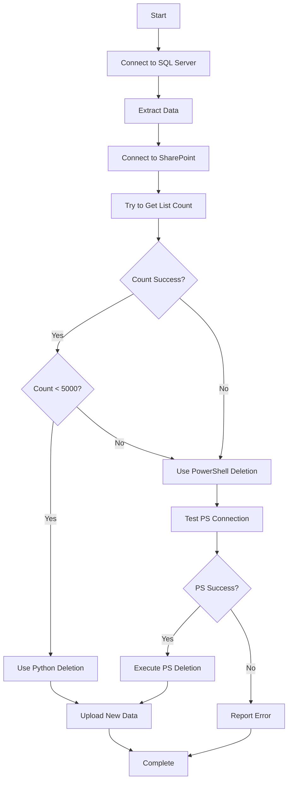

# SQL → SharePoint Hybrid Data Pipeline

A Python–PowerShell hybrid solution to sync SQL Server data into SharePoint Online lists while bypassing PowerApps' Premium connector requirement. Built for speed, reliability, and to overcome SharePoint’s 5,000-item view threshold

##  Features

- **Save Cost of License**: Saves the cost of PowerApps Premium SQL Server connector
- **Faster Bulk Deletion**: Deletes 10k+ rows in minutes, far faster than Power Automate
- **Batch Processing**: Efficiently handles lists of any size (tested with 15,000+ items)
- **Reusable**: Adaptable for any SQL → SharePoint list scenario

##  Prerequisites

### Software Requirements
- Python 3.7+
- PowerShell 5.1+ (Windows)
- SharePoint Client Components SDK

### Python Dependencies
```bash
pip install pandas python-dotenv sqlalchemy pyodbc shareplum
```

### SharePoint Client Libraries
Download and install: [SharePoint Client Components SDK](https://www.microsoft.com/en-us/download/details.aspx?id=42038)

##  Configuration

Edit the `.env` file in your project directory:

```env
server=your_sql_server
database=your_database_name
user=your_sql_username
pass=your_sql_password
email=your_sharepoint_email
emailpass=your_sharepoint_password
site=https://yourcompany.sharepoint.com/sites/YourSite
sharepointlink=https://yourcompany.sharepoint.com
```

## How It Works

### Process Flow



## Usage

##  Customization

### Modify SQL Query
Edit the query in `main.py`:
```python
query = """INSERT YOUR QUERY"""
```

### Change SharePoint List
Update the list name in `main.py`:
```python
sp_list = site.List("Your List Name")
```

### Adjust Batch Size
Modify PowerShell batch size in `passmanager.py`:
```python
$BatchSize = 500  # Change to your preferred size
```


### Performance Tips
- PowerShell deletion: ~500 items per batch (adjustable)
- Typical speed: 1,000-2,000 items per minute
- Large lists (10,000+ items) may take several minutes


---

** If this project helped you, please give it a star!**
